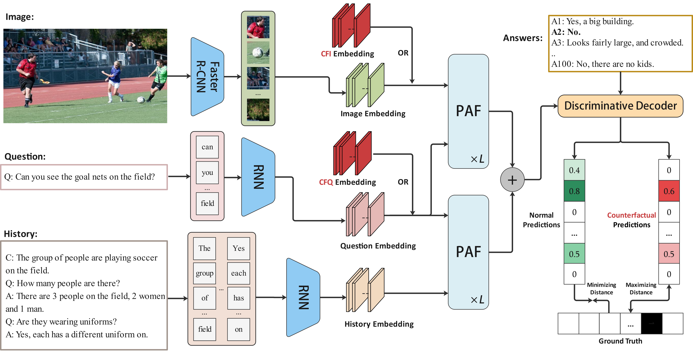

## CS-PAF

<div align=center></div>

## Credits

This repository is build upon [*visdial_conv*](https://github.com/shubhamagarwal92/visdial_conv) *(Agarwal et al.)*. We
express our sincere gratitude to the researchers for providing their code, which has been instrumental in the
development of this project.

## Environment Configuration

```shell
conda create -n cspaf python=3.7
pip install -r requirements.txt
```

```shell
python -c "import nltk; nltk.download('all')"
```

## Data Preparation

<table>
	<tr>
	    <th align="center">Dataset</th>
	    <th align="center">File</th>
	    <th align="center">Source</th>  
	</tr >
	<tr >
	    <td rowspan="10" align="center">Visdial v1.0</td>
	    <td align="center">features_faster_rcnn_x101_train.h5</td>
	    <td rowspan="4" align="center"><a href="https://github.com/batra-mlp-lab/visdial-challenge-starter-pytorch">visdial-challenge-starter-pytorch</a>
 (Das et al.)</td>
	</tr>
    <tr>
	    <td align="center">features_faster_rcnn_x101_val.h5</td>
	</tr>
    <tr>
	    <td align="center">features_faster_rcnn_x101_test.h5</td>
	</tr>
	<tr>
	    <td align="center">visdial_1.0_word_counts_train.json</td>
	</tr>
    <tr>
	    <td align="center">glove.npy</td>
        <td align="center"><a href="https://github.com/simpleshinobu/visdial-principles">visdial-principles</a>(Qi et al.)</td>
	</tr>
    <tr>
	    <td align="center">visdial_1.0_train.json</td>
        <td rowspan="5" align="center"><a href="https://visualdialog.org/data">visdial official</a></td>
	</tr>
	<tr>
	    <td align="center">visdial_1.0_val.json</td>
	</tr>
    <tr>
	    <td align="center">visdial_1.0_test.json</td>
	</tr>
    <tr>
	    <td align="center">visdial_1.0_train_dense_annotations.json</td>
	</tr>
    <tr>
	    <td align="center">visdial_1.0_val_dense_annotations.json</td>
	</tr>
    <tr >
	    <td rowspan="2" align="center">VisdialConv</td>
	    <td align="center">visdial_1.0_val_crowdsourced.json</td>
	    <td rowspan="2" align="center">subsets/visdialconv/(Agarwal et al.)</td>
	</tr>
<tr>
	    <td align="center">visdial_1.0_val_dense_annotations_crowdsourced.json</td>
	</tr>
<tr >
	    <td rowspan="2" align="center">VisPro</td>
	    <td align="center">visdial_1.0_val_vispro.json</td>
        <td rowspan="2" align="center">subsets/vispro/(Agarwal et al.)</td>
	</tr>
<tr>
	    <td align="center">visdial_1.0_val_dense_annotations_vispro.json</td>
	</tr>
</table>

## Train or Finetune

```shell
bash -i scripts/cap_hist_early_fusion_disc_train.sh
```

We use RTX 3090 to train the model, and the batch size per gpu is 12. With a gpu count of 2, we choose a learning rate of 5e-4.
The training logs and checkpoints will be saved in directory exps/exp_name.

## Evaluate

```shell
bash -i scripts/cap_hist_early_fusion_disc_eval.sh
```

The training logs and checkpoints will be saved in directory exps/exp_name.
If you want to get the results generated by [EvalAI](https://eval.ai/web/challenges/challenge-page/518/submission), you can submit the file exps/exp_name/ranks.json.

## Attention Map Visualization (optional)
You can visit the
repository [Faster-R-CNN-with-model-pretrained-on-Visual-Genome](https://github.com/shilrley6/Faster-R-CNN-with-model-pretrained-on-Visual-Genome)
which can generate 2048-d features. If you just want to quickly visualize the results of visdial v1.0, you can also
visit the project from our fork version [https://github.com/chenyulu2000/Faster-R-CNN-with-model-pretrained-on-Visual-Genome]. This project has modified some bugs and can generate h5 type files for visdial v1.0 val
set, which can be directly used in visual dialog visualization.
```shell
python attention_map_vis/extract_questions.py
```
```shell
python attention_map_vis/visualize.py
```
